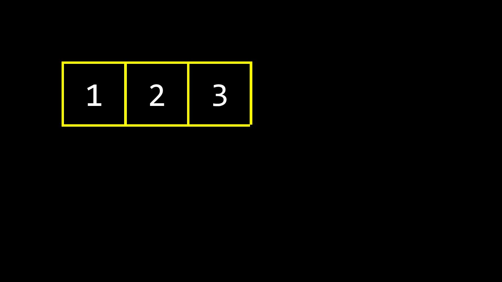
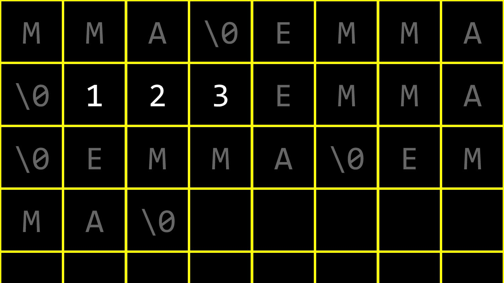
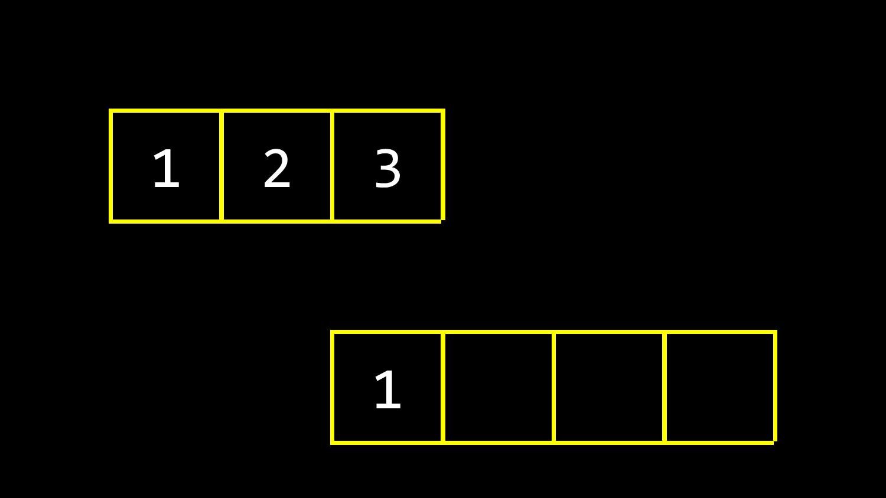
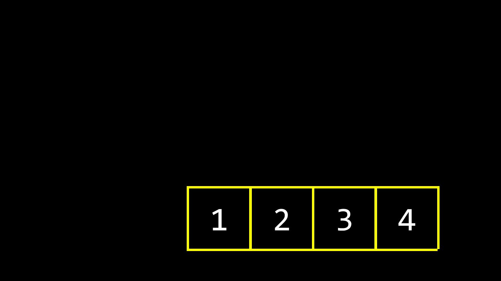
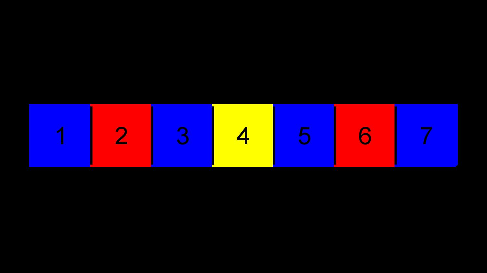
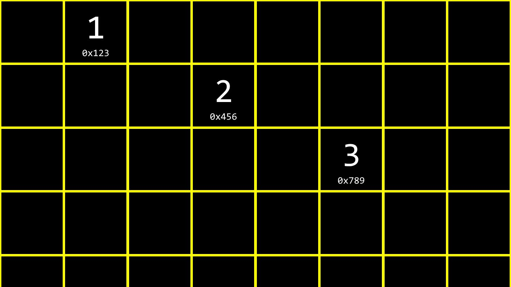
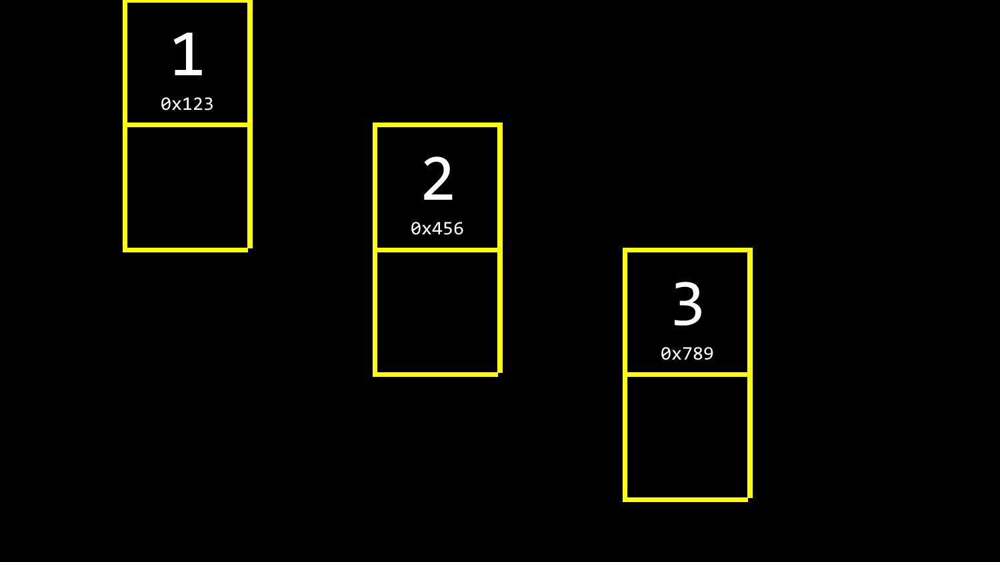
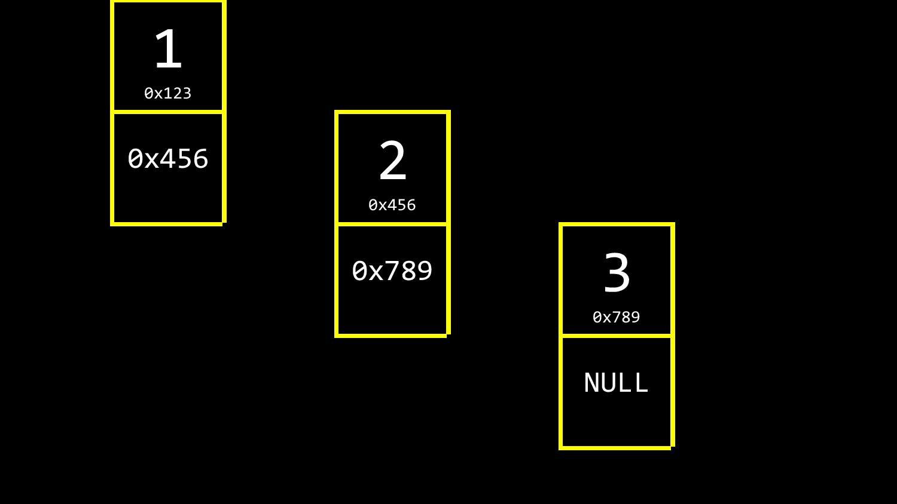
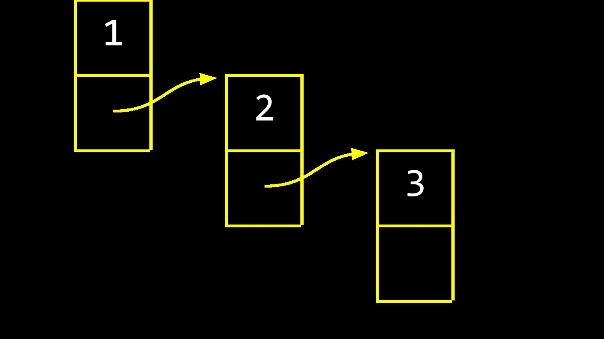
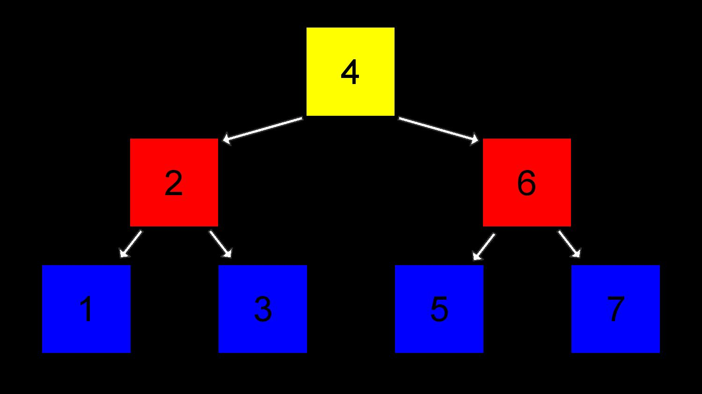

# Data Structure

## Array
How memory work in array


**Continus memory slots**


**Step for modify an array**

1. Allocate memory for new array with given size
1. Clone from old array
1. Free memory from old array

 
### Binary Search
```[1,2,3,4,5,6,7]```
[Details](../algorithms/search/README.md)





## Linked List
Suppose we have 1, 2, 3 items stored in the memory randomly, each has its own address in memory

If there is way to conncet them together, so when we create these in memory, we can ask twice of the memory, top part store the data

Where bottom store the address point to the next data
 
[Details](linkList/README.md)

## Binary Search Tree




  1. [Hash Map](data-structure/hashMap/README.md)
  1. [Set](data-structure/set/README.md)
  1. [Stack](data-structure/stack/README.md)
  1. [Binary Search Tree](data-structure/bst/README.md)